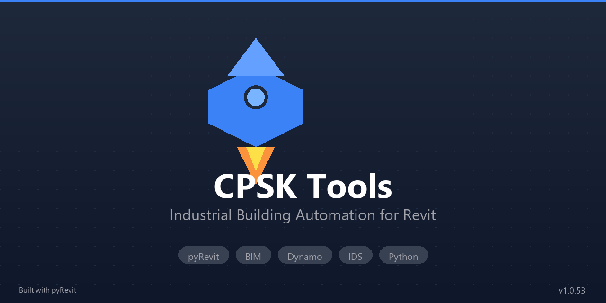

<div align="center">

# CPSK Tools

### Автоматизация промышленного строительства в Autodesk Revit

[](https://github.com/fesworkscience/pyrevit_rocket/releases)
[](https://github.com/pyrevitlabs/pyRevit)
[](https://www.autodesk.com/products/revit)
[](LICENSE)



</div>

---

## Возможности

- **Интеграция с Dynamo** — запуск скриптов Dynamo из ленты Revit
- **IDS Валидация** — проверка моделей по Information Delivery Specification
- **Управление семействами** — быстрая вставка и управление параметрами
- **Спецификации** — автоматизация ведомостей и спецификаций
- **Rhino/Grasshopper** — интеграция с Rhino.Inside.Revit
- **SLAM** — обработка облаков точек с LiDAR (iOS/Android)
- **КЖ** — автоматизация документации по разделу КЖ
- **IFC Checker** — проверка IFC файлов на соответствие IDS

## Требования

- **Autodesk Revit** 2022, 2023, 2024 или 2025
- **pyRevit** 5.0+
- **Windows** 10/11

## Установка

### Вариант 1: Установщик (рекомендуется)

Скачайте установщик из [Releases](https://github.com/fesworkscience/pyrevit_rocket/releases)

### Вариант 2: Ручная установка

```bash
# 1. Клонировать репозиторий
git clone https://github.com/fesworkscience/pyrevit_rocket.git

# 2. Добавить в pyRevit
# Revit → pyRevit → Settings → Custom Extension Directories → добавить путь

# 3. Перезапустить Revit

# 4. Настроить окружение: CPSK → Settings → Окружение → "Установить"
```

---

## Структура проекта

```
pyrevit.extension/
├── CPSK.tab/
│   ├── 01_Settings.panel/      # Настройки, авторизация
│   ├── 02_Dynamo.panel/        # Запуск Dynamo
│   ├── 03_QA.panel/            # IDS валидация
│   ├── 04_Families.panel/      # Семейства
│   ├── 05_Specifications.panel/# Спецификации
│   ├── 06_Rhino.panel/         # Rhino.Inside
│   ├── 07_КЖ.panel/            # Документация КЖ
│   └── 08_SLAM.panel/          # Облака точек
└── lib/                        # Общие библиотеки
```

---

## Разработка

### Как внести изменения

```bash
# 1. Форк и клон
git clone https://github.com/YOUR_USERNAME/pyrevit_rocket.git
git checkout -b feature/my-feature

# 2. Внести изменения...

# 3. ОБЯЗАТЕЛЬНО: проверить код чекером
python pyrevit.extension/lib/pyrevit_checker.py pyrevit.extension/CPSK.tab/ПАНЕЛЬ/КНОПКА/script.py

# 4. Коммит и пуш
git add . && git commit -m "Описание" && git push origin feature/my-feature

# 5. Создать Pull Request
# Перейти на https://github.com/fesworkscience/pyrevit_rocket/pulls → New pull request
```

### Требования к коду

| Запрещено | Использовать |
|-----------|--------------|
| f-строки `f"text {x}"` | `"text {}".format(x)` |
| `open(encoding=)` | `codecs.open()` |
| `MessageBox.Show` | `cpsk_notify` |
| `except: pass` | `except: show_error()` |

Подробнее: [CLAUDE.md](CLAUDE.md)

---

## Лицензия

MIT — см. [LICENSE](LICENSE)

---

## Поддержать проект

<div align="center">

<a href="https://gip.su">
  
</a>
&nbsp;&nbsp;
<a href="https://t.me/tehzak2">
  
</a>

<br><br>

**Евгений Федулов** — Lead Developer

[](https://t.me/tehzak2)

</div>

---

<div align="center">

Made with :heart: by [GIP GROUP](https://gip.su)

</div>
